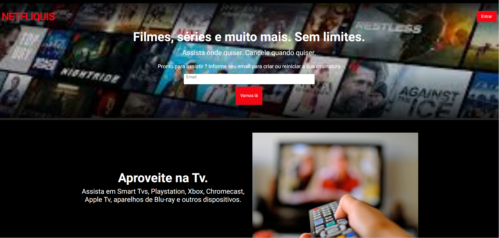

# Netfliquis

Netfliquis é uma página de destino protótipo para um serviço de streaming fictício, inspirado em plataformas populares como a Netflix. Esta página destaca os recursos e benefícios do serviço, com foco na facilidade de uso e acessibilidade.

## Recursos

- **Design Responsivo**: Funciona em todos os dispositivos, incluindo desktop, tablet e celular.
- **Integração com Bootstrap**: Utiliza Bootstrap 5 para uma interface moderna e limpa.
- **FAQ em Accordion**: Seção de perguntas frequentes interativa.
- **Assinatura por Email**: Campo de entrada para os usuários inserirem seu email para criar ou reiniciar sua assinatura.

## Tecnologias Utilizadas

- HTML5
- CSS3
- Bootstrap 5
- 
## Imagens

.

## Instalação

Para executar este projeto localmente:

1. Clone o repositório:
   git clone https://github.com/seu-usuario/netfliquis.git

2. Navegue até o diretório do projeto:
cd netfliquis

3.Abra o index.html em seu navegador para visualizar a página de destino.

##Uso

Barra de Navegação: Fornece acesso à página principal e botão de login.
Conteúdo Principal: Inclui texto promocional e um campo de entrada de email.
Seção de Benefícios: Descreve vários recursos do serviço.
Seção de FAQ: Contém itens colapsáveis para responder perguntas comuns.

##Contato

Para qualquer dúvida ou feedback, por favor, entre em contato:

Nome: Gabriel Mendes
Email: gabsdev02@gmail.com
LinkedIn: gabrielmendes02

  
